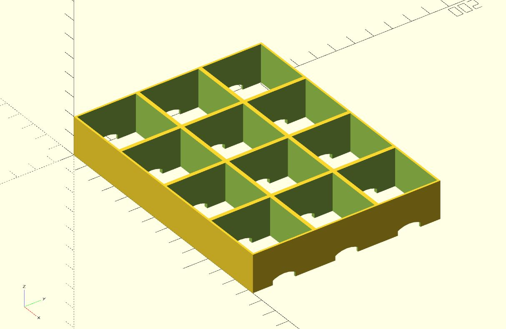

# Parametric LED Strip Panels

OpenSCAD script to create square pockets to run LED strips below. Funnels the light towards a semi-translucent surface such as white acrylic glass.

Hint: Print this with non-translucent, rather dark PLA/ABS/resin, then paint the part white

## Screenshots

