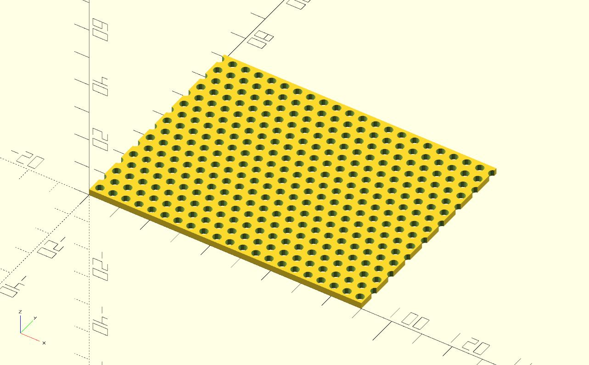

# Parametric Perforated Sheet

This small script let's you easily generate perforated sheets with cylindric holes either linearly aligned or offset. Simply change the variables to your needs.

## Screenshots

